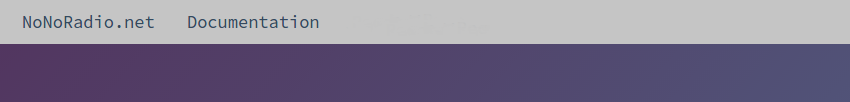
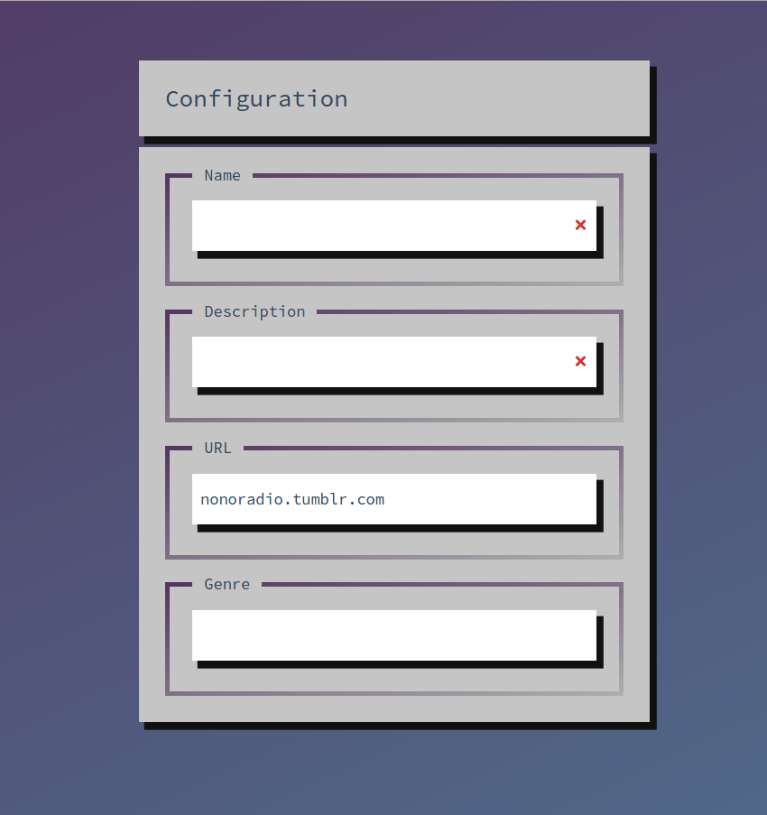
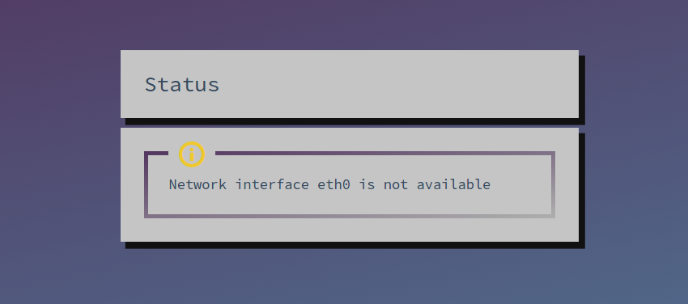
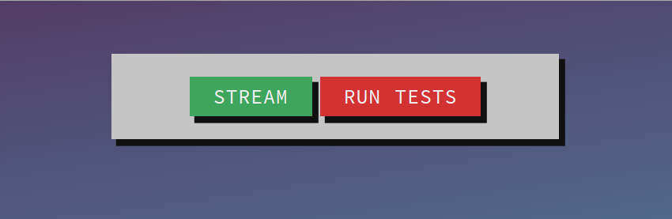
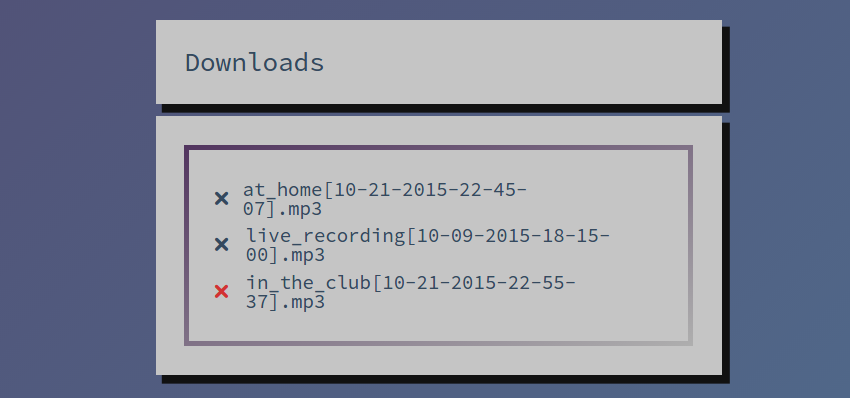

asdfasdf 

# Benutzeroberfläche

Um die Benutzeroberfläche zu erreichen, einfach die IP-Adresse des Rechners in den Browser eintippen.

Die Benutzeroberfläche besteht aus mehreren Komponenten.

## Navigation

Die Navigation der Seite besteht aus zwei Links:
* NoNoRadio.net führt zur Hompage des Projekts
* Documentation führt direkt zur Dokumentation der Software 

## Stream Konfiguration

In dieser Komponente kann man die Daten des Streams eintragen. 
Name und Description werden für den Betrieb eines Streams benötigt.

Eingabefelder mit rotem Kreuz sind ungültig und müssen korrigiert werden.
Solange das Formular ungültige Eingabefelder enthält, ist der Stream Button deaktiviert. 

* Name
    
    Der Name des Streams, ein Wort ist optimal. 
* Description
    
    Eine kurze Beschreibung des Streams, maximal 5 Worte.
* URL
    
    Eine gültige URL (http muss nicht angegeben werden) mit weiteren Informationen zum Stream. Optional.
* Genre
    
    Das Genre des Streams. Optional.

## Status Anzeige
In dieser Komponente erscheinen die selben Status-Meldungen wie auf dem LCD-Display, allerdings mit genauerer Beschreibung und statt einer Hintergrundfarbe haben sie ein Symbol in gelb oder rot.

Solange diese Anzeigen einen Fehler, also eine Meldung mit rotem Symbol, enthält ist der Stream Button deaktiert.

## Buttons
Mit diesen beiden Buttons kann entweder der Stream gestartet werden oder die Status-Test können wiederholt werden.

z.B. Falls das Netzwerkkabel nicht eingesteckt war während dem Aufstarten und eine Fehlermeldung in der Liste erscheint, kann man die Test wiederholen und damit den Fehler entfernen.

## Recordings
Diese Komponente enthält eine Liste aller auf dem Rechner verfügbaren Aufnahmen. Eine Aufnahme kann durch zweimaliges Klicken auf das **X** gelöscht werden.

