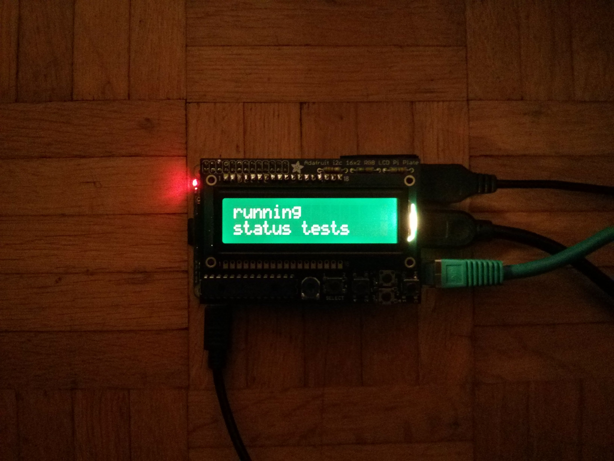
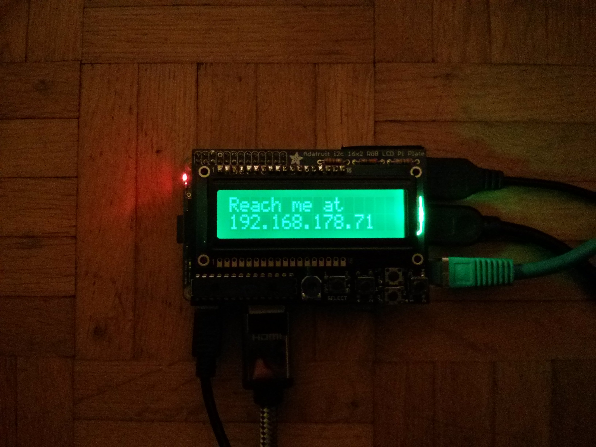
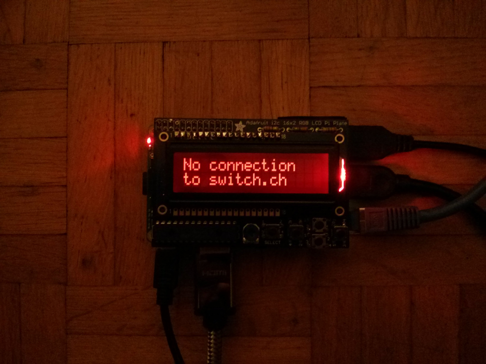

# How to run it

First unplug all cables.

* Connect the USB soundcard to the source.

* Connect the machine to your router and the internet

* Connect the computer to the power

* Now the board will boot up. The two status LEDs begin to blink.

* After approximately one minute the streaming software starts

* The software needs a few moments to run some status tests.

* If all tests were successfull the LCD display shows the current IP address.

* After the announcement of the IP addres the display is used to show some status information . There are three different kinds of status messages:
    * **green background color**: Everything is good (e.g. IP address, streaming status)
    * **yellow background color**: Attention, there seems to be a problem (e.g. scarce free memory, not soundcard identfied)
    * **red background color**: critical error (e.g. not network connection, no connection to the stream server)

#[The user interface](https://github.com/faebser/pi-stream/blob/master/docs/en/software.md)

