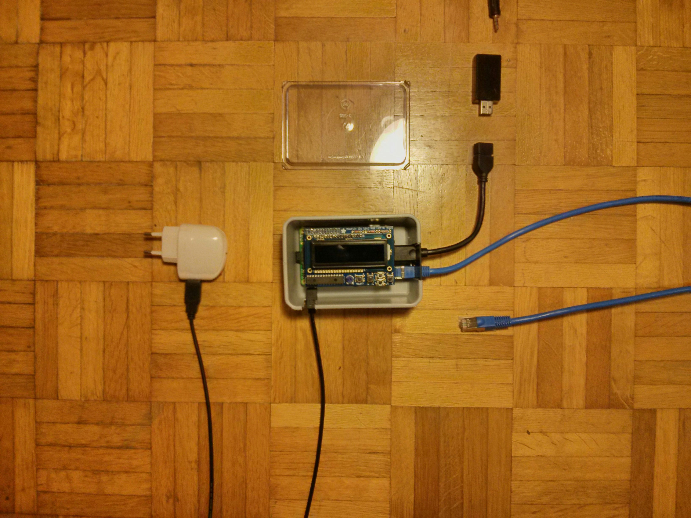
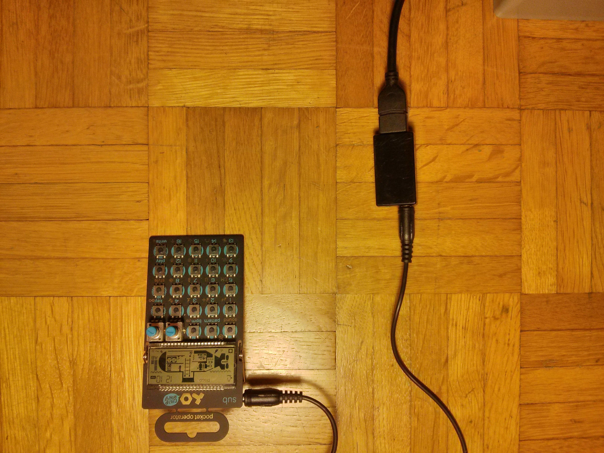
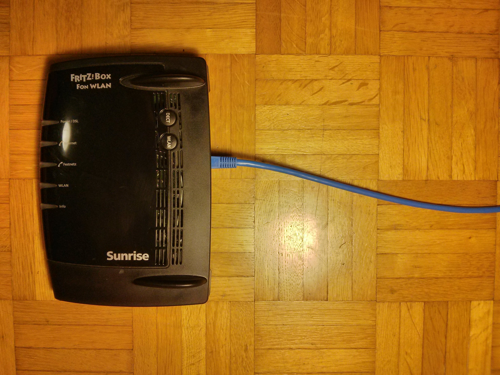
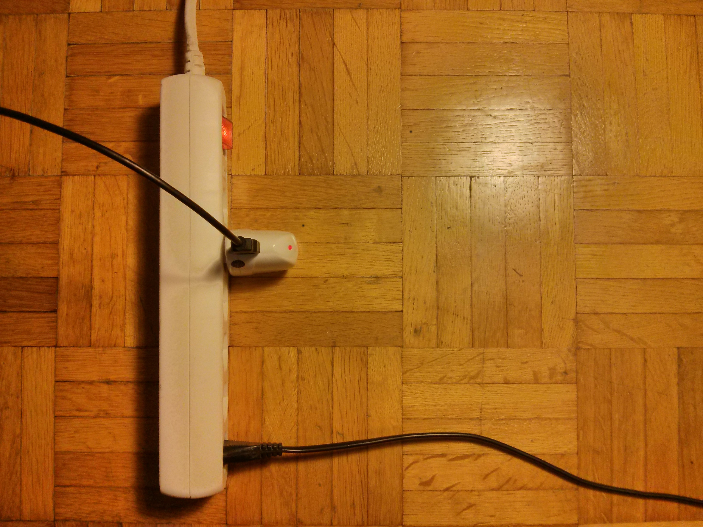
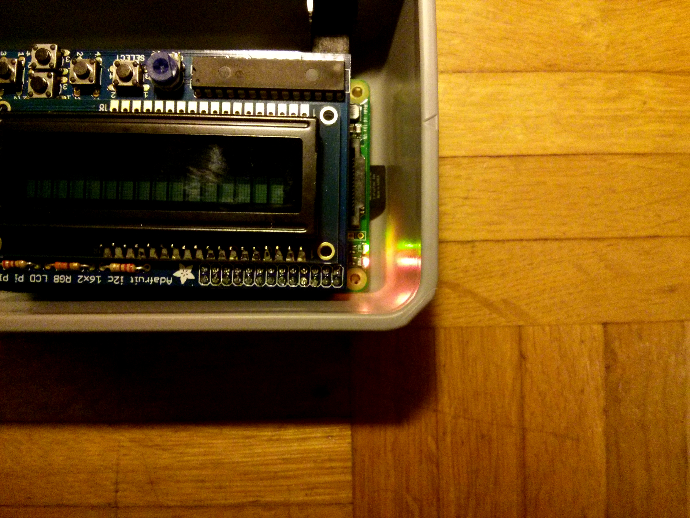
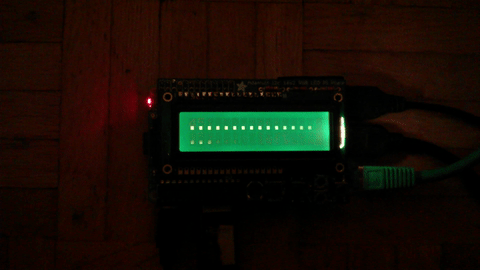

# Inbetriebnahme

Vor Inbetriebnahme alle Kabel ausstecken.

* Als erste das USB Kabel mit der USB-Aufnahmegerät und der Soundquelle verbinden.

* Dann das Netzwerkkabel mit dem Router verbinden

* Den Rechner an den Strom anschliessen

* Der Rechner startet und die beiden Status-LED an der Seite des Rechners beginnen zu blinken.

* Nach ungefähr einer Minute wird das Streaming-Programm gestartet.

